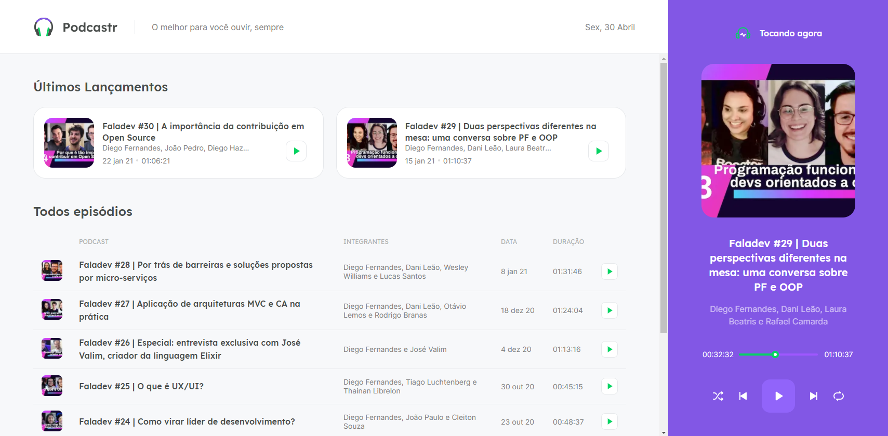

# Podcastr

  

### Languages

  
  
  

### Description
Poadcastr is a project result of an online course of rocketseat. The main purpose of the application is to play some episodes from podcasts and apply some react, typescript and next concepts.

### How to use
- git clone https://github.com/lpazzim/podcastr.git;
- cd podcastrnext;
- yarn install;
- yarn dev;

The application will be running on: http://localhost:3000/;
